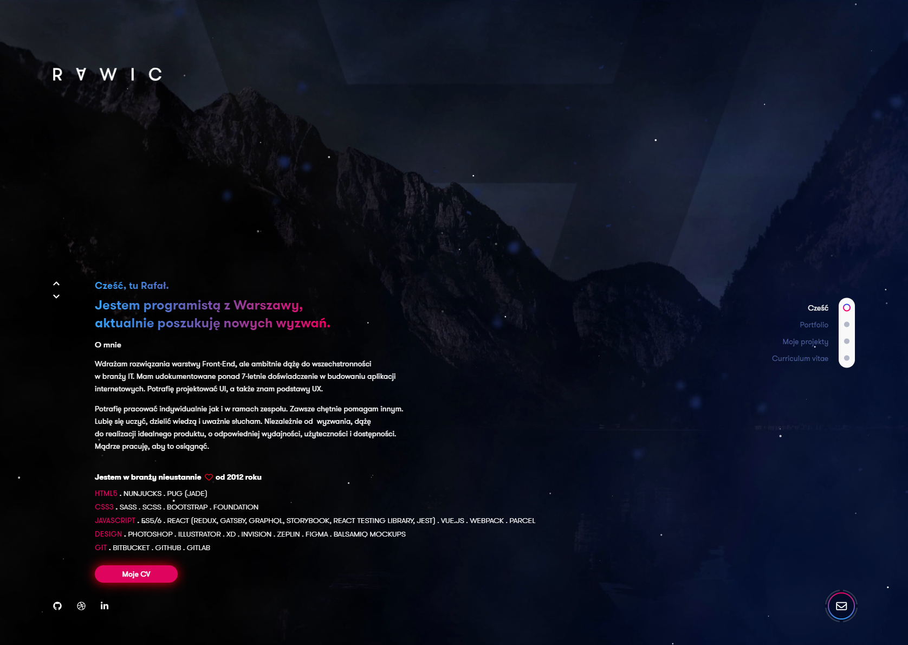

<p align="center">
  <a href="https://github.com/rawic/github-review">
    
  </a>

  <h3 align="center">rawic.me</h3>

  <p align="center">
    Personal website built with React, Gatsby & more. <a href="https://rawic.me" target="_blank" rel="noopener noreferrer">Live</a>
    <br />
    I hope to make it all over again.
  </p>
</p>

## About rawic.me

<a align="center" href="https://invis.io/CZQAF2DKATX#/362091415_RAWIC_-_Strona_G--wna" rel="nofollow noopener noreferrer" target="blank">
  
</a>

My very first website created in React. It is a bit old. I hope to make it from scratch as soon as possible.

### Installation

```sh
yarn
gatsby develop
```

### Built With

- [React](https://reactjs.org/)
- [Gatsby](https://www.gatsbyjs.com/)
- [Fort Awesome](https://fortawesome.com/)
- [styled-components](https://styled-components.com/)
- [Figma](https://www.figma.com/)

## License

Distributed under the MIT License. See `LICENSE` for more information.

## Contact

Rafał Wichowski - [@rafalwichowski](https://twitter.com/rafalwichowski) - [hi@rawic.me](mailto:hi@rawic.me)

Project Link: [https://github.com/rawic/rawic.me](https://github.com/rawic/rawic.me)

[app-screenshot]: readme/app-screenshot.jpg
